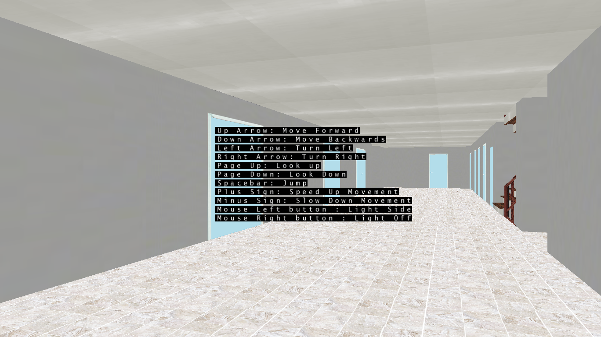

# Building Simulation

## language
- C# OpenGL

## Explanation

This is a simulation of exploring buildings using the arrow keys.

Press the X key to open the door by rotating the x and z directions.

The stairs can be moved up and down using the x and y coordinate changes.

